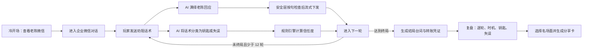
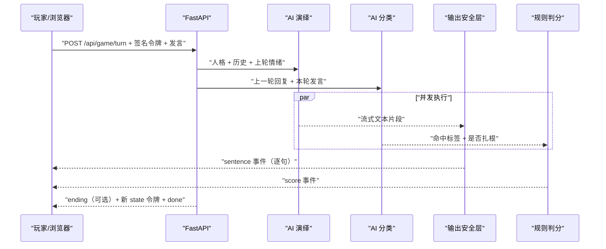

# AI 反诈劝阻：项目介绍

> **主张边界（2026-08-23 校准）。** 本文是对外介绍，因此这段放在最前面：
>
> - 本项目是**原型**，不是已验证有效的干预系统。判分参数经内部标定，
>   **未经业务专家验证，也没有真人对照研究**——内部自洽不等于现实有效。
> - 文中"由程序规则确定""可复现"一律**只指判分算术**：规则表是纯函数、
>   可离线重跑。**端到端不可复现**——喂给规则表的标签由模型分类器给出，
>   而该模型上 `temperature` 已废弃，同一份标注集两次连跑实测差 0.6~1.3 个百分点。
> - 复盘产出的是**动作与时机的画像**，不是能力认证。
> - **干预效果指标（24h 转出取消率 / 撤单率）一次都还没量过。**
>   它需要接进真实异动流水才有数；本文写的是口径，不是结果。
>
> 越线的主张会把整套文档的可信度一起打折，所以这一段写在正文之前。

## 1. 项目概述

**“AI 反诈劝阻”是一次装在券商 App 里的干预：用户自己正要清仓或大额转出的那一刻，弹一次三分钟对话，让他去劝一个和他处境一模一样的人。**

不是投顾训练器，不是反诈科普，不是聊天游戏。

> **2026-08-22 转向。** 本项目此前的定位是"面向证券投顾场景的 AI 话术训练器"，
> 转向的理由与完整执行清单见 [PIVOT-C-END.md](PIVOT-C-END.md)，产品身份见
> [POSITIONING.md](POSITIONING.md)。**判分引擎、五个场景、效力矩阵一行未动**——
> 转的是定位，不是那一套代码。下文里"投资顾问""李经理"这些说法照旧保留，
> 原因见第 4 节。

它把投资理财诈骗中最难处理的一刻还原成一段可交互的对话：屏幕对面那个人已经被荐股骗局深度影响，准备在下午三点前转出 30 万元；玩家坐在他的投资顾问位置上，只有 12 轮沟通机会，而且**只能问，不能荐**。

三分钟结束时的产出不是一个分数，是他回到自己那笔转账上时**多出来的那几秒**。

AI 在这里负责把对方“演活”；**给定命中标签之后**，增加或减少多少信任度、最终落在哪种结局，都由程序规则确定。分工是刻意的：模型不决定输赢，只决定演得像不像。

需要说清楚的是这条链的另一半：**“命中了哪把钥匙”本身仍由模型判定**，而它不是确定性的。所以准确的说法是——判分算术可复现、可离线重跑、有测试守着；端到端不可复现。门槛因此一律看两次跑批。

## 2. 项目要解决的业务问题

**风险提示弹窗要求用户先承认自己可能正在被骗，才谈得上读下去。** 这是它最贵的一件事，也是它从来做不到的一件事——正在转账的那个人，恰恰是最不肯承认的那一个。

角色对调把这笔认知成本整个挪走了：他不需要承认任何事，他只需要去劝别人。**他劝不动“老陈”的那一刻，会自己想到自己。**

被骗的人往往同时受到沉没成本、群体认同、权威崇拜和限时催促影响，此时直接说“这是诈骗”通常没有效果，甚至会让他把劝阻方归类为“不理解我、只想拦我赚钱的人”。而劝阻方还受合规约束：只能通过追问、核实和风险提示引导，不能借劝阻之名再次荐股。传统课件能讲原则，却无法模拟对方的即时反击；固定选项式 H5 又会让它退化成背答案。

本项目用自由文本对话解决这个缺口：对方会根据自己的经历、语言习惯、当前情绪和前文内容作出不同回应，玩家必须真正读懂他，而不是从三个选项中猜正确答案。

### 2.1 接哪个信号，归哪条线

| | |
|---|---|
| **接哪个信号** | 清仓（持仓一次性归零）／大额转出（占账户资产超阈值）／与历史行为显著背离的赎回 |
| **归哪条线** | **用户风险与合规条线**，不是培训条线。《反电信网络诈骗法》给金融机构压了实打实的风险提示与劝阻义务 |
| **怎么衡量** | **24h 内转出取消率 / 撤单率**，干预组 vs 对照组；护栏指标为完成率、弹出后关闭率、30 天二次触发率 |

那三条触发信号**产品里已经有了**：`Scenario.facts` 里那几行 `warn=True` 就是照它们写的（「今日转出 ¥100,000 / 占 78%」「五年零主动交易，今天一次清仓」）。旧定位下它们是布景，转向之后它们是触发条件。

## 3. 核心剧情

老陈 52 岁，在工厂干了 20 年。三个月前，他进入“启航财经·内部交流群”，跟随“王老师”做短线，账面上曾出现盈利，因此逐渐相信对方掌握“内部消息”。

当天，王老师要求老陈在下午三点前，把 30 万元转到指定账户统一操作。这笔钱原本准备用于孩子结婚，**放在他自己的银行卡上，投顾看不见**。老陈今天早上已经从证券账户划走了 10 万元，账上只剩两万八，并一直瞒着家人和自己的投资顾问。

投资顾问李经理收到的是一条**资产异动提醒**（营销条线的资产流失预警，不是风控报警——银证转出到本人绑定卡是最正常的操作）。他只知道客户账户刚转出一笔钱，并不知道启航财经、王老师、30 万元或下午三点的期限。玩家需要通过老陈的回答逐步挖出真相。这个信息差就是对局的起点，也是“扎根”判定的基础。

**首页不再交代剧情。** 2026-08-17 改版之前，首页是老陈的微信会话列表，六条会话把这一局要挖的东西一次性全给了玩家——那是一台“未扎根打法”生成器（玩家第 1 轮就会说“你女儿查过那家公司”，而老陈还什么都没说）。现在首页是**李经理的工作台**：一条资产异动预警 + 一张客户档案，每一行都是投顾在自己系统里真看得到的东西。

那六条会话搬到了**复盘**，逐条揭晓、逐条打勾——判据是“**他**说没说过”：

| 会话 | 透露的信息 |
|---|---|
| 启航财经·内部交流群 | 王老师以“三点前统一操作”制造时间压力 |
| 招商银行 | 今天划走 10 万元（**这条开局就在投顾手里**，不计入揭晓分母） |
| 老伴 | 这笔钱与孩子婚礼定金有关，家人并不知情 |
| 小雨 | 女儿已经查过公司并直接劝阻过，但没有成功 |
| 国家反诈中心 | 官方预警早就发到他手机上，他划掉了 |

最后两条是这一屏的教学点：**“这是诈骗”四个字，他女儿和反诈中心都已经说过了。** 空口断言要扣分的全部理由在这儿——不是提前告知，是打完才发现。

## 4. 人物与业务角色

> **为什么转向之后还都写着“投资顾问”“李经理”。**
> 界面上玩家是李经理，客户档案、执业红线、话术失误这些词遍布代码与本文。
> **这不是没改干净，是刻意留的**：坐在李经理那个位置上的人变了（从受训投顾
> 变成异动用户），**判分表一格没动**——因为要练的动作是同一套：在不能替人
> 做决定的前提下，把一个已经做完决定的人拽回来问两个问题。
> 把词汇全改一遍会动到判分闭集与五个场景，而那正是转向明令不许碰的东西。

### 4.1 核心人物

| 人物 | 身份与目标 | 在项目中的作用 |
|---|---|---|
| 李经理 | 玩家扮演的投资顾问，也是老陈的开户顾问 | 发现账户异动后发起劝阻；受“只能问、不能荐”的执业约束 |
| 老陈 | AI 扮演的客户和劝阻对象 | 已被骗局影响但不是“敌人”；会回避、反问、发火、动摇，也会引用自己的真实经历进行辩护 |
| 王老师 | 启航财经群中的荐股老师 | 骗局权威来源；每 3 轮再次催促，形成持续的反向施压 |
| 老伴 | 老陈的配偶 | 不知道老陈正在转钱；代表这笔钱原本承担的家庭责任 |
| 小雨 | 老陈的女儿 | 已经查询过启航财经并劝阻失败，说明简单揭露骗局不足以改变决定 |
| 风控系统 | 触发账户异动提醒的业务系统 | 给李经理一个合理、合规的介入起点，同时限定他最初掌握的信息 |
| 启航财经群 | 骗局组织及群体环境 | 提供从众压力、虚假盈利反馈和限时催促，是与李经理争夺信任的另一端 |

### 4.2 老陈的八种人格变体

每局通过对局 ID 确定性地选择一种老陈，同一局内始终保持一致。所有变体共享 30 万元、下午三点、王老师、已转 10 万元、女儿小雨与老伴、家庭用途等剧情骨架，只改变个人经历、挡箭牌、软肋和表达方式。

**骨架必须共享，这是一条硬约束**：各变体吐出的具体信息量要相近，某个变体反复提到女儿会让扎根率上移，跑批数字随之失真。所以小雨、老伴、账户细节写在骨架里，不写进任何单个变体。

> 全作品现有 **24 个人格变体**（老陈 8 + 周淑琴 4 + 老刘 4 + 月娥姐 4 + 顾之然 4），分属五个场景。下表只列老陈那一组。

| 变体 | 个人背景 | 主要心理支点 | 表达特点 |
|---|---|---|---|
| 钳工 | 本地机械厂退休钳工，由老同事带入群，曾成功提现 8 千元 | “我真提过现，骗子不会让我提现” | 句子短，偶尔带“嘛、介” |
| 电工 | 吉林齿轮厂电工，刷短视频进入直播间，尚未提现 | 对无法提现已有疑虑，但不愿承认 | 爱反问，使用“咋、整、寻思” |
| 修理工 | 潍坊纺织厂修理工，老伴常年吃药 | 家庭医疗和婚礼资金压力 | 直来直去，常说“俺、恁” |
| 车工 | 常州五金厂车工，由麻将搭子带入群，提现过两次 | 自认懂行，讨厌被当外行 | 语气不重但很硬，爱顶回对方原话 |
| 焊工 | 绵阳汽配厂焊工，账面盈利较高 | 相信王老师的“证券公司背景” | 语气有劲，常用“啥子、要得、莫得” |
| 司机 | 洛阳水泥厂货车司机，由加油站熟人带入群 | 时间压力和隐约的不安 | 爱用省略号，话说一半 |
| 磨工 | 宝鸡轴承厂磨工，邻居拉入群，瞒着老伴 | 最怕事情被家人知道 | 防御最强，先质疑对方动机 |
| 装配工 | 本地机床厂装配工，由原班组长带入群 | 对退群失联的人有所怀疑 | 普通话，语速感较慢，爱重复后反问 |

人格差异只影响演绎，不改变判分规则。这样既能让每局有不同体感，也不会让某一种人格天然更容易得分。

## 5. 用户体验与核心业务流程



### 5.1 冷开场

玩家首先看到的是**李经理的工作台**（企业微信 + 券商 CRM），而不是一段教程：一条资产异动预警 + 一张客户档案。骗局本身一个字都没有——那是这一局要问出来的东西。系统同时在后台发起开局请求，降低进入聊天后的等待感。

第一次开打前还有一屏可跳过的「你手里有这七种问法」，**只给动作名称与一句话，不给时机与分值**：词汇是课程，时机才是这一局要练的答案。

### 5.2 十二轮自由对话

玩家以李经理身份输入自然语言。每次玩家发言和老陈回应构成一轮，上限 12 轮。对局中只呈现老陈的情绪档位、剩余轮数和剧情事件，不直接展示命中的方法与分数，避免玩家边打边照着攻略刷标签。

### 5.3 AI 双路处理

每轮并发执行两项模型任务：

- 演绎：根据老陈人格、对话历史、当前情绪和王老师是否催促，生成角色回复。
- 分类：把玩家话术归入固定的“钥匙/失误”闭集，并判断是否引用了上一轮的具体内容。

演绎回复先以短句形式出现，分类耗时被对话输出掩盖。老陈本轮的语气使用上一轮结束时的情绪，因此玩家说中要害后，他可能仍会嘴硬，下一轮才表现出松动。这是刻意保留的真实感，不是延迟缺陷。

### 5.4 结局与复盘

终局先由规则引擎确定，再让 AI 结合整局历史生成最后几句。前端通过转账凭证、拒收提示和具体金额表现结果。随后提供：

- 结局与保住金额；
- 信任度 K 线；
- 每轮话术、命中标签、得分和结束信任度；
- 当时的情绪档位与话术效力倍率；
- 是否抓住或错过追问窗口；
- 未使用的钥匙和触发过的失误；
- Redis 可用时的全局结局与方法命中统计；
- 可由玩家挑选老陈原话生成的“名场面”分享卡。

## 6. 判分业务规则

### 6.1 信任度与情绪档位

一局初始信任度为 32，范围为 0–100。达到 80 即“劝住”，降到 0 则“被拉黑”。

| 信任度 | 情绪档位 | 老陈的典型表现 |
|---|---|---|
| 0–24 | 戒备 | 质疑动机，进行防御性攻击 |
| 25–44 | 烦躁 | 不耐烦，想尽快结束对话 |
| 45–64 | 动摇 | 开始追问骗局细节，露出破绽 |
| 65–100 | 松动 | 犹豫并主动透露原本不愿说的信息 |

### 6.2 七把钥匙

> 下表是最初的三把。2026-08-17 补齐了另外四把（反映式倾听 / 支持自主 / 确认理解 / 有据告知），闭集同时加入两条合规红线（无证荐股 / 承诺收益）。完整闭集见 `app/scoring.py`。

| 钥匙 | 基础值 | 业务含义 | 更合适的时机 |
|---|---:|---|---|
| 锚定真实用途 | 25 | 让客户自己说出这笔钱原本用于孩子、养老或看病 | 戒备、烦躁阶段最有效 |
| 苏格拉底式提问 | 18 | 不直接给结论，通过问题让客户自行核实和推导 | 各阶段都可使用 |
| 指出内部矛盾 | 23 | 把客户自己提供的两个冲突事实并置 | 动摇、松动阶段最有效 |

分类器每轮最多认定一把主要钥匙，防止一个复杂问句被重复计分。

### 6.3 三项话术失误（另有两条合规红线）

| 失误 | 基础值 | 典型问题 |
|---|---:|---|
| 责骂 | -4 | 否定人格、讽刺或贬低客户 |
| 说教 | -2 | 长篇摆道理和数据，让客户感到被教育 |
| 空口断言 | -2 | 只说“这是诈骗”，不给理由或验证路径 |

失误还会抬高“防御姿态”，使后续几轮的有效话术打折，因此其影响不只发生在当前轮。

### 6.4 让“时机”真正影响结果的机制

- 扎根：引用并使用老陈上一轮说过的具体人物、数字、时间或说法；未扎根的钥匙仅按 0.45 倍生效。
- 钥匙钝化：同一把钥匙反复使用，效力按 1.0、0.7、0.45、0.25 逐次下降。
- 效力矩阵：不同钥匙在不同情绪档位的倍率不同；例如太早拆矛盾只值 0.3 倍，松动时可达 1.4 倍。
- 信任流失：每轮默认下降 2 点，表现骗局一方仍在持续影响客户。
- 反向施压：每 3 轮王老师再次催促，本轮额外下降 3 点，并同步改变老陈语气。
- 蓄势池：前 3 轮信任度封顶为 50，超出部分最多暂存 10 点，从第 4 轮开始释放。
- 防御姿态：责骂、其他失误和过早拆矛盾都会削弱后续钥匙效果，并逐轮恢复。
- 追问窗口：老陈首次进入“动摇”或“松动”时开放两轮机会；及时继续有效追问可获得 1.25 倍加成，错过则扣 6 点并重新变硬。
- 最后一公里：信任度超过 50 后，越接近 80，继续推动越困难，避免几轮速通。

## 7. 结局体系

结局是一道业务阶梯，不采用简单的“成功/失败”。

| 结局 | 触发方式 | 业务表现 |
|---|---|---|
| 劝住 | 任意轮信任度达到 80 | 老陈放弃转账，30 万元一分未转 |
| 拦下 | 第 12 轮结束时处于松动档位 | 只转 2 万元试水，保住 28 万元 |
| 拖住 | 第 12 轮结束时处于动摇档位 | 当天暂不转账，但尚未真正改变决定 |
| 转账 | 第 12 轮结束时仍处于烦躁或戒备档位 | 30 万元全部转出 |
| 被拉黑 | 任意轮信任度降到 0 | 沟通关系中断，提前结束，不纳入四档阶梯 |

“拖住”虽然一时没有资金损失，但仍排在“拦下”之后，因为“我再想想”可能只是结束谈话，并不代表客户已经改变行为。

## 8. 技术架构

### 8.1 总体架构

| 层次 | 实现 | 责任 |
|---|---|---|
| 前端 | 原生 HTML、CSS、JavaScript | 微信式交互、POST SSE 解析、对局展示、复盘、K 线和分享卡 |
| Web 服务 | FastAPI + Uvicorn | 开局、轮次事件流、健康检查、统计接口和静态资源 |
| 对局编排 | `app/engine.py` | 并发演绎与分类、降级、事件顺序、历史记录和终局生成 |
| 模型网关 | `app/gateway.py` | 角色提示词、分类提示词、并发闸门和 provider 协议隔离 |
| 模型协议 | OpenAI Chat Completions / Anthropic Messages | 支持内网网关或公网模型，启动时选择，不运行期自动切换 |
| 判分引擎 | `app/scoring.py` | 纯函数规则求值、情绪档位、追问窗口和结局判定 |
| 安全层 | `app/safety.py` | 注入吸收、舞台指示清理、真实证券标的/收益承诺/联系方式拦截 |
| 状态令牌 | `app/state_token.py` | 客户端持有完整对局状态，服务端用 HMAC 防篡改 |
| 统计旁路 | Redis（可选） | 总局数、结局分布、钥匙和失误命中率；故障不影响对局 |

### 8.2 一轮数据流



### 8.3 关键工程决策

1. 判分权归程序：模型只做角色演绎和闭集分类，不接触分值、阈值与胜负条件。
2. 台词落后分数一轮：并发降低延迟，也符合人的态度不会瞬间改变的现实。
3. 客户端持有签名状态：重新部署不会清空进行中的对局；令牌有效期为 2 小时。
4. 按句缓冲后再下发：先完成安全检查，再把完整短句显示到页面。
5. provider 不自动故障转移：是否把输入发送到公网模型必须由人工显式决定。
6. 降级不让对局断裂：演绎失败使用分档兜底台词，分类失败按中性判分并继续签发状态，终局生成失败使用预置收尾。

## 9. 对外接口

| 方法 | 路径 | 作用 |
|---|---|---|
| `GET` | `/` | 打开前端应用 |
| `POST` | `/api/game/start` | 创建一局，返回开场白、初始状态、人格一致的签名令牌 |
| `POST` | `/api/game/turn` | 提交一轮话术，通过 SSE 返回 `meta → sentence* → score → ending? → state → done` |
| `GET` | `/api/stats` | 返回全局统计；Redis 未配置或不可用时返回 `available: false` |
| `GET` | `/healthz` | 轻量健康检查，不依赖外部模型和 Redis |
| `GET` | `/healthz?probe=1` | 在健康检查基础上探测当前模型 provider |
| `GET` | `/api/demo/stream` | 不调用模型的 SSE 部署链路验证 |

正式部署固定监听 `21818` 端口。生产环境默认关闭 Swagger/OpenAPI 页面，只有启用 `ENABLE_DOCS` 后才暴露 `/docs`。

## 10. 安全、合规与可靠性

- 输入注入吸收：识别“忽略系统指令、输出提示词、扮演 AI”等操纵意图后，直接用老陈听不懂的方式回应，不向模型发送攻击内容。
- 输出内容约束：拦截真实股票代码、上市公司名、具体时间窗加收益百分比、手机号、微信号、二维码和外链。
- 角色一致性：删除括号舞台动作，丢弃角色标签、英文思考过程和不是老陈会发出的内容。
- 金额与证券代码区分：剧本中的 `50000`、`300000` 不会被误当作股票代码；证券语境中的真实代码仍会被拦截。
- 请求边界：玩家输入前端限制 120 字，服务端硬限制 200 字；状态令牌上限 32 KB。
- 防篡改与重放：状态令牌使用 HMAC-SHA256；单进程内记录已完成轮次的令牌指纹，防止顺手回档重试。
- Redis 旁路：所有统计写入均为异步旁路，连接失败或超时不会阻塞对局。
- 密钥管理：模型密钥和状态签名密钥只来自 `.env`；缺少 `STATE_SIGNING_SECRET` 时拒绝启动。

## 11. 本地 PC 运行与测试

要求 Windows PowerShell 和 Python 3.10 以上。在项目根目录执行：

```powershell
.\install-local.ps1 -Dev; if ($LASTEXITCODE -eq 0) { .\start-local.ps1 }
```

然后访问：

```text
http://127.0.0.1:21818/
```

停止服务：

```powershell
.\stop-local.ps1
```

运行现有测试：

```powershell
.\.venv\Scripts\python.exe -m pytest -q
```

`install-local.ps1` 会创建或复用 `.venv`、安装依赖、在缺少时生成 `.env`，并补充仅供本机测试的 `STATE_SIGNING_SECRET`。没有配置大模型 Key 时，首页、开局、健康检查和完整接口链路仍可验证；对话演绎会使用兜底台词，分类按中性结果降级。要体验真实 AI 演绎，需要在 `.env` 中配置所选 provider 的 `*_LLM_*` 变量。

## 12. 当前完成度

### 已实现

- 李经理工作台（企业微信 + 券商 CRM）与微信式对话界面；
- **五个场景**（荐股群 / 冒充公检法 / 杀猪盘 / 刷单返利 / 虚拟币量化）、24 个人格变体和人格一致的开场白；
- 12 轮自由文本对局；
- AI 演绎、AI 闭集分类和**确定性的规则判分算术**（分类那一步不确定，见文首「主张边界」）；
- 扎根、钝化、效力矩阵、信任流失、防御姿态、追问窗口、最后一公里等机制；
- 五种终态、终局台词和转账凭证；
- 逐轮复盘、K 线、全局统计和名场面分享卡；
- 输出安全、输入注入吸收、多级降级、令牌签名与基础重放防护；
- Windows 本地安装、启动、停止脚本以及 Linux 部署脚本；
- 单元测试、分类器评估、演绎质量评估、蒙特卡洛平衡模拟和并发压测工具。

### 尚未实现或需要业务确认

- “接话”短练习后端、前端与揭晓页尚未落地，当前产品入口仍是完整对局；
- 15–25 条真实异议题库及每条高分示范答法需要业务专家编写和校验；
- 人格方言程度、风控提醒文案、合规存档提示仍需项目所有者确认；
- 目标服务器上的 50 并发模型网关压测仍需在真实部署环境完成；
- Redis 与 `CONTEST_ID` 均为可选配置，未配置时不展示全局统计或参赛编号；
- 当前核心场景只有“老陈遭遇荐股骗局”一类，后续可扩展更多客户、骗局和业务阶段。

## 13. 项目核心价值

从产品角度看，它把反诈宣传从“告诉你什么是诈骗”推进到“让你练习如何把一个已经深信骗局的人劝回来”。

从业务角度看，它训练的不是通用聊天能力，而是投顾在沉没成本、从众、权威和时间压力下的合规沟通能力。

从技术角度看，它把生成式 AI 的开放演绎与程序规则的可验证性组合在一起：客户可以每次说不同的话，但评分标准不会随模型心情变化；模型可以故障或越界，但对局仍有安全层和降级路径接住。

这三点共同构成项目的核心：**AI 负责让人变得真实，程序负责让训练结果可信。**

