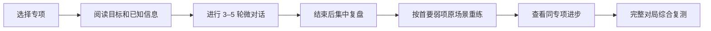

# 一线投顾日常专项短练设计

> ## ⛔ 作废（2026-08-23）
>
> **这份设计的前提已经不成立了。** 它建立在"项目首先为一线投顾能力提升负责"
> 之上（下面决策摘要第 1 条），而 2026-08-22 的转向把定位改成了
> **C 端异动干预**：[POSITIONING.md](../../POSITIONING.md)、
> [PIVOT-C-END.md](../../PIVOT-C-END.md)。
>
> **干预是一次性的，它没有"日常"可言**——用户是在按下转账确认的那一刻被拦
> 下来的，不会明天再来练一次。"3–5 分钟短练""同题重练""进步曲线"
> 这套闭环在新定位下整体降级（PIVOT §4 第 5 条）。
>
> **别照着它实施。** 留档是因为里面有两样东西还值钱：
> 那份逐条标注的验收清单，以及"界面文案不许宣称按监管要求存档"那条
> （它后来长成了 [ADR-0006](../../adr/0006-transcript-retention-for-the-pivot.md)
> 的告知要求）。
>
> 日期：2026-08-18  
> 状态：**作废**（原为"已确认，待制定实施计划"）  
> 产品目标：帮助一线投资顾问通过 3–5 分钟、3–5 轮的微对话反复练习反诈劝阻能力。  
> 本文是设计规格，不包含实施代码。

## 1. 决策摘要

本设计基于已经确认的四项产品决策：

1. 项目首先为一线投顾能力提升负责，比赛传播退居次要位置。
2. 第一阶段用于日常自练，不承担正式考核或认证。
3. 日常训练以 3–5 分钟专项短练为主，现有 12 轮对局保留为综合复测。
4. 每次短练采用 3–5 轮微对话，局中不显示分数，结束后集中复盘。

不采用“直接把现有对局缩短到 3–5 轮”的方案。专项短练拥有独立领域模型，与完整对局共用大模型网关、输出安全层和部分分类能力，但不复用单一信任度、随机结局和游戏平衡规则。

## 2. 问题定义

当前完整对局适合展示连续剧情，但不适合作为日常训练主入口：

- 一局时间长，不能针对一个薄弱能力高频重复。
- 单一信任度同时承担关系、风险认知和转账结果，无法形成准确能力画像。
- 场景随机选择，学习者不能固定场景重练并比较前后变化。
- CRM 已知事实没有进入分类上下文，使用工作台证据可能被判为未扎根。
- “问出隐藏事实”根据客户台词关键词推断，没有验证玩家提问与客户披露之间的因果关系。
- 演绎或分类降级不能完整反映到训练有效性，可能形成虚假反馈。
- 复盘信息过长，缺少一个明确、可立即执行的下一步。

专项短练要解决的核心问题是：让学习者在一个明确目标上完成一次短练，获得基于对话证据的反馈，并能立即用同一场景重练。

## 3. 产品边界

### 3.1 首期范围

- 本地学习者档案，无需注册登录。
- 六个预置专项训练单元。
- 每个训练单元 3–5 轮微对话。
- 局后集中复盘和同场景重练。
- 同一专项的最近尝试与进步趋势。
- SQLite 本地持久化。
- 演绎、分类和存储降级状态透明展示。
- 现有完整对局作为“综合复测”继续存在。

### 3.2 首期不做

- 正式考试、资格认证或强制及格线。
- 组织架构、管理者看板、SSO、LMS 和 CRM 集成。
- 自动生成无限场景。
- 学员排名、传播排行榜和训练分享卡。
- 语音识别、音色克隆或真人客户数据导入。
- 用大模型直接输出总分或职业能力结论。

## 4. 用户体验

### 4.1 首页入口

首页提供三个清晰入口：

1. **今日短练**：优先推荐最近未练或最薄弱的专项；没有历史时从“降低防御”开始。
2. **专项训练**：按骗局类型和能力选择训练单元。
3. **综合复测**：进入现有 12 轮完整对局。

日常自练首页不突出救回金额、胜率和分享卡。

### 4.2 一次短练



进入短练前只显示：

- 本次练习目标。
- 投顾当前依法、依职能可以看到的 CRM 事实。
- 预计用时和最大轮数。
- 一句约束提示，例如“本轮只练如何让客户愿意继续说”。

对话过程中只显示客户自然反应、剩余轮数和系统故障提示，不显示标签、分值、钥匙或攻略。

### 4.3 集中复盘

首屏只呈现五项内容：

1. 本次目标：完成、部分完成或尚未完成。
2. 做得最好的一句话，并引用对应客户反应作为证据。
3. 当前首要改进项，只给一个。
4. 一个符合当前上下文的改写示例。
5. “针对这个问题再练一次”按钮。

逐轮分类、计算细节、完整对话和其他能力维度折叠展示。复盘不得用“你没有一句推动客户”这类只描述结果、不提供改法的反馈。

## 5. 首批训练单元

| 编号 | 场景 | 专项能力 | 训练目标 | 建议轮数 |
|---|---|---|---|---:|
| D01 | 荐股群 | 降低防御 | 使用反映式倾听或支持自主，让客户愿意继续沟通 | 3 |
| D02 | 荐股群 | 发现真实用途 | 问出资金原本用途，并确认这笔损失的具体生活代价 | 4 |
| D03 | 荐股群 | 指出内部矛盾 | 用已披露信息构造一个成立的矛盾，不空口定性 | 4 |
| D04 | 冒充公检法 | 承接恐惧与羞耻 | 识别客户主要恐惧，避免责骂或加重羞耻 | 3 |
| D05 | 冒充公检法 | 核验办案事实 | 围绕电话办案、通缉令或安全账户完成事实核验 | 4 |
| D06 | 冒充公检法 | 推进行动 | 推动至少一个可观察动作：暂停转账、挂断电话或联系官方渠道 | 5 |

每个训练单元只有一个主目标，可以记录其他能力表现，但不能让其他能力替代主目标完成条件。

## 6. 领域模型

### 6.1 DrillDefinition

训练单元的版本化定义，包含：

- `id`：稳定标识，如 `D01`。
- `version`：规则、素材或目标发生变化时递增。
- `scenario_id`：对应骗局场景。
- `primary_skill`：本次唯一主能力。
- `objective`：给学习者看的目标文案。
- `turn_limit`：3–5。
- `known_facts`：投顾开局有权看到的 CRM 事实。
- `hidden_facts`：必须由客户披露后才能使用的事实。
- `completion_rule`：程序可求值的完成条件。
- `persona_pool`：允许使用的人格变体。
- `rubric_version`：绑定的评分规则版本。

### 6.2 TrainingAttempt

一次不可覆盖的训练尝试：

- `id`、`learner_id`、`drill_id`、`drill_version`。
- 开始、完成时间和实际轮数。
- `status`：`active`、`completed`、`abandoned`、`invalid`。
- `validity`：是否发生演绎、分类或存储降级。
- 复盘摘要和与上一有效尝试的比较结果。

同场景重练必须新建 Attempt，不覆盖前一次记录。

### 6.3 TurnEvaluation

每轮保存：

- 玩家原话和客户回复。
- 闭集动作标签与合规标签。
- 动作引用的证据来源。
- 本轮新披露的隐藏事实。
- 客户状态变化。
- 是否命中主目标的一部分。
- 演绎与分类是否降级。
- 分类规则和模型版本。

### 6.4 TrainingReview

由确定性规则生成：

- 主目标完成状态。
- 五维能力结果。
- 最强证据轮次。
- 首要改进项。
- 上下文改写示例。
- 推荐重练单元。
- 与同专项上一有效尝试的变化。

## 7. 客户状态与评分

### 7.1 客户状态

专项训练不使用单一信任度，改为四类状态：

- `defense_level`：防御程度。
- `disclosed_facts`：已经由客户披露的事实集合。
- `risk_awareness`：`unaware`、`questioning`、`recognizing`。
- `action_readiness`：`none`、`pause`、`verify`、`stop`。

这些状态用于决定客户下一轮演法和判断训练目标是否完成，不合成为一个给学习者看的总分。

### 7.2 能力维度

复盘使用五个独立维度：

| 维度 | 判断内容 |
|---|---|
| 沟通建立 | 倾听、尊重、支持自主，是否降低防御 |
| 事实发现 | 是否通过有效提问得到关键事实 |
| 风险澄清 | 是否用合法可见证据完成矛盾分析、理解确认或有据告知 |
| 行动推进 | 是否推动暂停、挂断、核验或求助等可观察动作 |
| 合规安全 | 是否荐股、承诺收益、越权或使用不当客户信息 |

每个维度使用“尚未体现、初步体现、有效使用、稳定使用”四档描述，不输出伪精确百分制总分。

### 7.3 判分边界

- 大模型只输出闭集标签、证据引用和事实披露候选，不输出分数或是否及格。
- 程序验证模型输出中的事实标识是否属于当前可见事实集合。
- CRM 已知事实从第一轮起合法可用。
- 隐藏事实只有客户实际披露后才加入可见事实集合。
- 跨轮综合允许引用完整历史，不再只允许引用上一轮。
- “问出事实”必须满足玩家提问与紧随其后的客户披露存在对应关系。
- 一轮只能归属一个主沟通动作；合规事件独立并存。
- 能力表现与客户最终行动分开记录，不能因为客户仍不配合就清零。

## 8. 系统架构

### 8.1 模块边界

建议新增独立包，避免继续扩大现有 `engine.py`、`scoring.py` 和 `static/app.js`：

```text
app/training/
  catalog.py       训练单元查询与版本选择
  models.py        训练领域对象与枚举
  session.py       3–5 轮状态机和编排
  rubric.py        确定性求值与复盘生成
  evidence.py      已知事实、披露事实和证据引用验证
  repository.py    持久化端口
  sqlite_repo.py   本地 SQLite 实现

static/training/
  api.js            训练接口客户端
  state.js          页面状态
  catalog.js        专项选择页
  practice.js       微对话页
  review.js         集中复盘页
  progress.js       进步趋势页
```

现有完整对局继续使用客户端签名状态；专项短练使用服务端 Attempt 记录。两者不得共享状态令牌或把短练硬塞入 `GameState`。

### 8.2 依赖方向

`HTTP/API → training.session → rubric/evidence → repository`。

- `session` 依赖模型网关抽象，不依赖具体 provider。
- `rubric` 是纯规则模块，不访问网络和数据库。
- `repository` 是端口，SQLite 是首个实现。
- 前端只消费服务端复盘，不复制评分规则。

## 9. 接口设计

### 9.1 查询训练单元

`GET /api/training/drills`

返回训练单元摘要、建议顺序和最近一次有效尝试，不返回隐藏事实或评分规则。

### 9.2 开始训练

`POST /api/training/attempts`

请求包含 `drill_id` 和本地 `learner_id`。响应包含 Attempt 标识、目标、已知事实、客户开场和轮数上限。

重复提交通过请求幂等键避免创建多个 Attempt。

### 9.3 提交一轮

`POST /api/training/attempts/{attempt_id}/turns`

请求包含本轮玩家发言和单调递增的 `turn_no`。响应使用现有 SSE 机制，事件顺序为：

1. `meta`
2. `sentence*`
3. `turn_state`
4. `attempt_state`
5. `done`

局中 `turn_state` 只包含剩余轮数和故障状态，不下发评分标签。

### 9.4 完成与复盘

`POST /api/training/attempts/{attempt_id}/complete`

达到轮数上限或主目标形成明确行为结果时完成。响应返回集中复盘。

### 9.5 查询进步

`GET /api/training/progress?learner_id=...&skill=...`

只比较相同 `drill_id` 和兼容 `rubric_version` 的有效尝试。规则版本不兼容时分段展示，禁止直接计算升降。

## 10. 持久化与隐私

本地默认使用 SQLite，数据库文件放在固定数据目录，而不是仓库或静态目录。保存：

- 本地学习者标识。
- Attempt、轮次、复盘和规则版本。
- 运行时降级与错误状态。

不保存：

- 真实客户姓名、账号、身份证号或真实交易数据。
- 模型 provider 密钥。
- 未经用户输入的设备信息。

界面文案使用“训练记录保存在本机”。只有未来真正接入合规留痕系统并明确保留策略、访问权限和删除机制后，才能宣称“按监管要求存档”。

## 11. 降级与错误处理

### 11.1 演绎降级

模型演绎失败时可以使用人工兜底台词保持流程可用，但必须：

- 当轮显示“AI 演绎已降级”。
- Attempt 标记为包含演绎降级。
- 该次可供学习者自看，但默认不进入进步趋势。

### 11.2 分类降级

分类超时、解析失败或证据校验失败时：

- 不按中性结果悄悄推进。
- 不消费本轮次数。
- 保留玩家输入，提示原句重试。
- 连续两次失败后允许结束本次 Attempt，并标记 `invalid`。

### 11.3 存储失败

- 创建 Attempt 失败时禁止进入训练，避免产生无法复盘的假记录。
- 轮次写入与状态推进使用同一事务。
- 响应中断后，客户端用 Attempt 和 `turn_no` 查询结果，不能简单重发造成重复轮次。

### 11.4 场景与文案一致性

压力事件、人物称谓、代词、金额、收款方和复盘文案全部来自训练单元或场景定义。前端不得写死“王老师”“老陈”“三把钥匙”等场景常量。

## 12. 测试策略

### 12.1 单元测试

- 每个训练单元的完成规则。
- CRM 已知事实从第一轮可用。
- 隐藏事实披露前不可用、披露后可用。
- 跨轮证据引用。
- 提问与事实披露的因果关联。
- 能力表现与客户行动结果分离。
- 合规事件独立记录。
- 规则版本不兼容时不比较趋势。

### 12.2 契约测试

- 五个训练 API 的请求、响应和错误码。
- SSE 事件顺序与中断恢复。
- 幂等开始、幂等轮次提交。
- 演绎、分类和存储三类降级。

### 12.3 前端测试

- 六个训练单元的场景文案不串场。
- 局中不泄露评分标签。
- 复盘首屏只有一个首要改进项。
- 重练创建新 Attempt，并保留上一次结果。
- 降级提示可见且不会进入趋势。
- 375×812、480px 宽度和桌面窄窗可完成全流程。

### 12.4 人工标定

首期每个训练单元至少准备 30 条人工标注输入，覆盖正确动作、近似错误、合规红线和跨轮引用。正式发布前由至少一名投顾培训人员和一名合规人员抽查复盘结论。

## 13. 验收标准

- 学习者能在 3–5 分钟完成一次短练。
- 每个训练单元严格为 3–5 轮，且只有一个主目标。
- 同一训练单元可立即原场景重练。
- 第二次有效尝试能看到相对第一次的具体变化。
- CRM 已知事实能够被正确识别为有效证据。
- 隐藏事实不会在客户披露前参与判分。
- “问出事实”不会因客户随机台词或兜底台词误报。
- 分类失败不会生成正式训练成绩。
- 演绎、分类和存储降级对学习者完全可见。
- Windows PowerShell 和 Git Bash 均可完成安装、启动、训练、复盘和分析。
- 界面不再作出未真实实现的监管存档承诺。
- 现有完整对局功能不受专项训练上线影响。

## 14. 实施分期

### 第一阶段：训练内核

- 建立训练领域模型、SQLite 仓库和六个训练单元。
- 实现服务端 Attempt 状态机、证据集合和确定性 rubric。
- 打通训练 API，不改完整对局。

### 第二阶段：训练前端

- 增加首页入口、专项选择、微对话和集中复盘。
- 增加同场景重练和本地进步趋势。
- 修复全局场景常量与降级可见性。

### 第三阶段：标定与复测

- 建立六套人工标注样本。
- 完成投顾培训与合规抽查。
- 将完整对局调整为综合复测入口，但不改变其现有玩法和数值。

组织管理、认证、LMS 和正式监管留痕属于后续独立项目，不进入本规格的实施计划。
